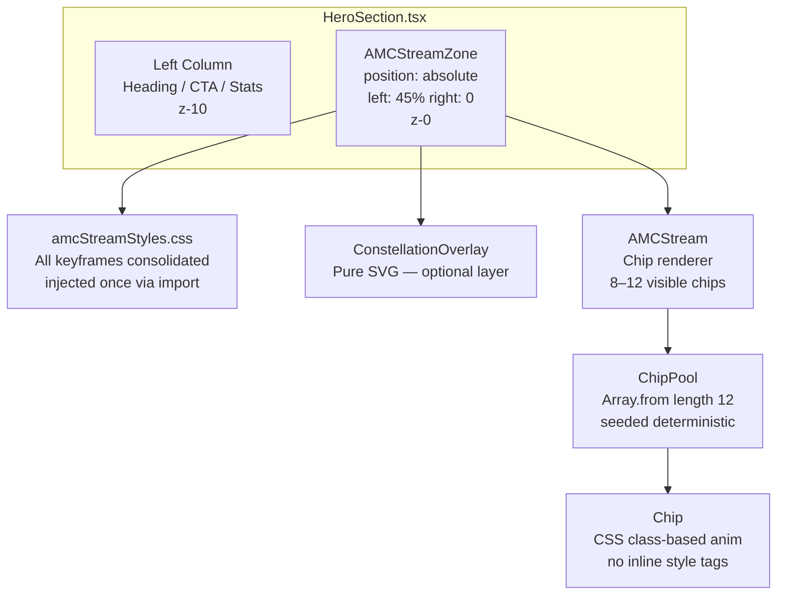
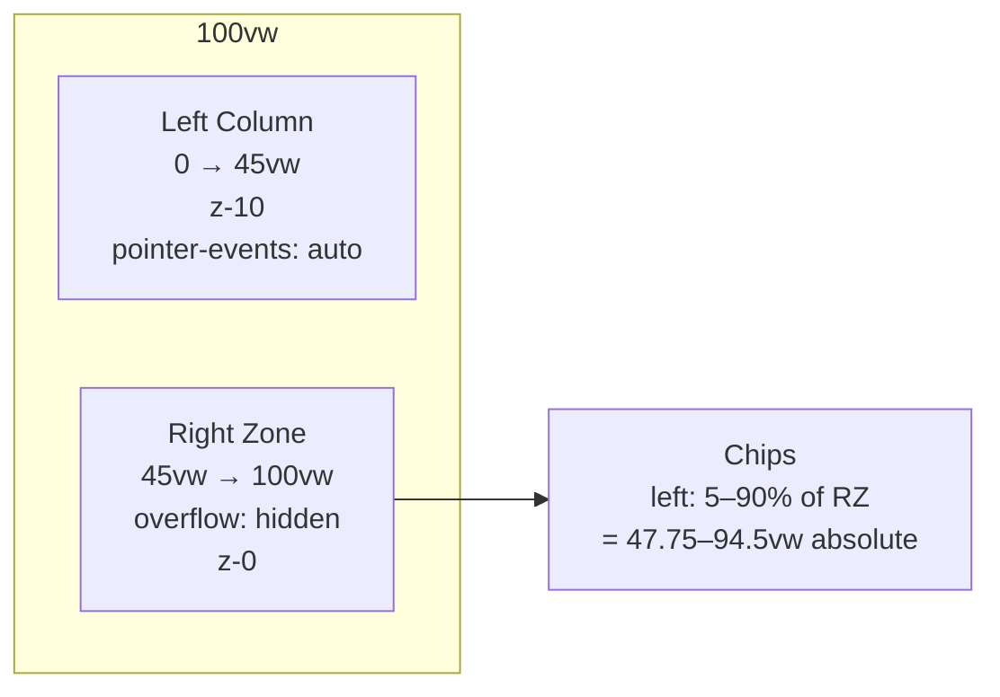
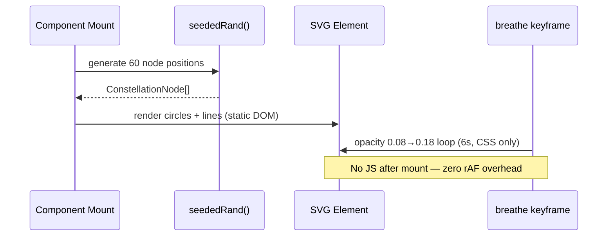

# Design Document: AMC Stream Refinement

## Overview

Redesign and refine the existing `AMCStream` component in the Mummidi Finserve LLP hero section to produce a premium, uncluttered chip-stream animation that is fully confined to the right-side hero zone, runs at smooth 60fps, and eliminates the 72-injected-style-tag performance problem. Optionally layer a lightweight SVG constellation overlay (the existing `FamilyConstellationScene` Three.js canvas replaced by a pure-CSS/SVG approach) behind the chips in the same right-side zone.

---

## Visual Zone Diagram

```
┌──────────────────────────────────────────────────────────────────────┐
│  HeroSection  (100vw × 100vh)                                        │
│                                                                      │
│  ┌──────────────────────┐  │  ┌───────────────────────────────────┐  │
│  │   LEFT COLUMN        │  │  │   RIGHT ANIMATION ZONE            │  │
│  │   max-w-[560px]      │  │  │   left: 45vw → right: 100vw       │  │
│  │   z-index: 10        │  │  │   z-index: 0                      │  │
│  │                      │  │  │                                   │  │
│  │  • Badge             │  │  │  Layer 0 (optional):              │  │
│  │  • H1 heading        │  │  │  SVG Constellation dots/lines     │  │
│  │  • Sub-copy          │  │  │  (static SVG, CSS breathing anim) │  │
│  │  • CTA button        │  │  │                                   │  │
│  │  • Stat cards        │  │  │  Layer 1:                         │  │
│  │                      │  │  │  AMC Chip stream (8–12 chips)     │  │
│  │                      │  │  │  3-layer depth parallax           │  │
│  └──────────────────────┘  │  └───────────────────────────────────┘  │
│                             │                                         │
│  ◄──── ~45% viewport ──────►◄──────── ~55% viewport ────────────────►│
│                             │                                         │
│  ◄── Solid white fade ─────►│  ◄── Top/bottom edge fades            │
│     (left-protection mask)  │                                         │
└──────────────────────────────────────────────────────────────────────┘
```

**Key constraint**: Chips are rendered inside a container positioned `left: 45%` so that even at their leftmost sway excursion they never enter the text column.

---

## Architecture



### Placement change in `HeroSection.tsx`

Currently `<AMCStream />` is placed as `absolute inset-0 z-0`, meaning chips can fall across the entire hero including the text column. The left-protection gradient at 42% is a cosmetic patch, not a real boundary.

The fix is to move the animation container to occupy only the right portion:

```
position: absolute
top: 0, bottom: 0
left: 45vw  (or left: 45%)
right: 0
overflow: hidden
pointer-events: none
z-index: 0
```

The left column stays at `z-index: 10` and is entirely outside the animation container's bounding box — no chip can bleed across, regardless of sway amplitude.

---

## Components and Interfaces

### Component 1: `AMCStreamZone` (new wrapper in HeroSection)

**Purpose**: Provides the right-side clipping boundary. Replaces the current `absolute inset-0` placement of AMCStream.

**Interface**:
```typescript
// No props — purely structural positioning wrapper
// Rendered directly inside HeroSection alongside the left column
<div
  aria-hidden
  style={{
    position: 'absolute',
    top: 0, bottom: 0,
    left: '45%', right: 0,
    overflow: 'hidden',
    pointerEvents: 'none',
    zIndex: 0,
  }}
>
  <ConstellationOverlay />   {/* optional */}
  <AMCStream />
</div>
```

---

### Component 2: `AMCStream` (redesigned)

**Purpose**: Renders 8–12 floating AMC chips with 3-layer depth parallax, sine-wave sway, DOF blur, and micro-rotation. All animation keyframes are CSS class-based — no per-chip `<style>` injection.

**Interface**:
```typescript
interface AMCStreamProps {
  chipCount?: number;          // default: 10
  glowOnScroll?: boolean;      // default: true
}

export default function AMCStream(props?: AMCStreamProps): JSX.Element
```

**Responsibilities**:
- Generate deterministic chip configs from seeded random (no `Math.random`)
- Apply the correct CSS animation class per chip (one of 3 × layer × variant sets)
- Trigger glow state on scroll / hover via a single `useState`
- Render top, bottom edge fade masks inside its own container

---

### Component 3: `ConstellationOverlay` (optional new component)

**Purpose**: Lightweight SVG constellation of ~60 connected dots representing the 500+ families stat. Replaces the heavy Three.js/R3F `FamilyConstellationScene` for this hero zone.

**Interface**:
```typescript
interface ConstellationOverlayProps {
  nodeCount?: number;          // default: 60
  breathe?: boolean;           // default: true — CSS opacity pulse
}

export default function ConstellationOverlay(props?: ConstellationOverlayProps): JSX.Element
```

**Responsibilities**:
- Generate node positions once with seeded random (no React re-renders)
- Render as a single `<svg>` element: `<circle>` nodes + `<line>` connections
- Apply a single CSS `@keyframes breathe` animation for the gentle opacity pulse
- Keep total DOM nodes ≤ 120 (60 circles + ~60 lines)

---

## Data Models

### `ChipConfig`

```typescript
interface ChipConfig {
  id: string;                  // e.g. "chip-3"
  amcIndex: number;            // index into AMC_LIST (0–11)
  layerIndex: 0 | 1 | 2;      // far / mid / front
  leftPct: number;             // 5–90% within the right-zone container
  animClass: string;           // CSS class, e.g. "chip-fall-a3"
  blurClass: string;           // CSS class, e.g. "chip-dof-b2"
  delayS: number;              // animation-delay (negative = pre-started)
}
```

### `LayerConfig`

```typescript
interface LayerConfig {
  scale: number;               // e.g. 0.72 / 0.88 / 1.00
  opacity: number;             // e.g. 0.12 / 0.22 / 0.32
  blur: string;                // e.g. "2.5px" / "1px" / "0px"
  speedS: number;              // fall duration in seconds
  zIndex: 1 | 2 | 3;
}
```

### `ConstellationNode`

```typescript
interface ConstellationNode {
  cx: number;    // x position in SVG viewBox (0–100)
  cy: number;    // y position in SVG viewBox (0–100)
  r: number;     // radius (1.5–4)
  color: string; // navy / gold / blue
  phaseOffset: number; // for staggered breathe animation-delay
}
```

---

## Performance Optimization Plan

### Problem: 72 Injected `<style>` Tags

The current implementation creates two `@keyframes` blocks per chip × 36 chips = **72 `<style>` elements** injected into the DOM. Each uses a unique animation name (`fall-chip-0`, `sway-chip-0`, `dof-chip-0`…). This:
- Bloats the CSSOM
- Forces style recalculation on every re-render
- Cannot be optimized by the browser's style-sheet cache

### Solution: Pre-baked CSS Class Library

Instead of generating unique keyframes per chip, define a **finite set of reusable keyframe variants** in a single static CSS file imported once at module level.

**Strategy — Parameterize via CSS Custom Properties**:

Each chip's sway amplitude, rotation, and DOF blur values are expressed as inline CSS custom properties on the chip element itself. The keyframes reference those properties via `var()`. This yields one shared `@keyframes fall` definition instead of 36:

```css
/* amcStream.css — injected ONCE, shared across all chips */

@keyframes amc-fall {
  0%   { transform: translateX(calc(var(--sway) * -1px)) translateY(-110px) rotate(var(--rot-start)); }
  25%  { transform: translateX(calc(var(--sway) * var(--freq) * 1px)) translateY(25vh) rotate(calc(var(--rot-start) * 0.4)); }
  50%  { transform: translateX(calc(var(--sway) * -0.7px)) translateY(50vh) rotate(0deg); }
  75%  { transform: translateX(calc(var(--sway) * 0.9px)) translateY(75vh) rotate(calc(var(--rot-end) * 0.5)); }
  100% { transform: translateX(calc(var(--sway) * -0.4px)) translateY(calc(100vh + 100px)) rotate(var(--rot-end)); }
}

@keyframes amc-dof {
  0%   { filter: blur(calc(var(--blur-base) + 3px)); opacity: 0; }
  12%  { filter: blur(var(--blur-base)); opacity: var(--opacity-base); }
  45%  { filter: blur(0px); opacity: calc(var(--opacity-base) * 1.15); }
  55%  { filter: blur(0px); opacity: calc(var(--opacity-base) * 1.15); }
  88%  { filter: blur(var(--blur-base)); opacity: var(--opacity-base); }
  100% { filter: blur(calc(var(--blur-base) + 3px)); opacity: 0; }
}

.amc-chip {
  position: absolute;
  animation:
    amc-fall var(--duration) linear var(--delay) infinite,
    amc-dof  var(--duration) linear var(--delay) infinite;
  will-change: transform, opacity, filter;
}
```

Each chip's wrapper then receives only inline CSS custom properties (not style tags):

```tsx
<div
  className="amc-chip"
  style={{
    left: `${config.leftPct}%`,
    zIndex: config.layer.zIndex,
    '--sway': config.swayAmp,
    '--freq': config.swayFreq,
    '--rot-start': `${config.rotStart}deg`,
    '--rot-end': `${config.rotEnd}deg`,
    '--blur-base': config.layer.blur,
    '--opacity-base': config.layer.opacity,
    '--duration': `${config.duration}s`,
    '--delay': `${config.delay}s`,
    transform: `scale(${config.layer.scale})`,
    transformOrigin: 'center top',
  } as React.CSSProperties}
>
```

**Result**: 2 `@keyframes` blocks total (down from 72). Zero per-chip style injection. CSSOM size reduced ~97%.

### Chip Count: 10 On-Screen (down from 36)

The `CHIPS` array is reduced from 36 to 10–12 entries. With 3 depth layers that means ~3–4 chips per layer — visually layered but never crowded. The seeded random ensures positions are well-distributed across the container width.

```typescript
const CHIP_COUNT = 10; // configurable via prop, max 12
const CHIPS: ChipConfig[] = Array.from({ length: CHIP_COUNT }, (_, i) => { ... });
```

### `will-change` Scope

`will-change: transform, opacity, filter` is already set per chip. With 10 chips (vs 36) the GPU compositing layer budget is well within safe limits for mobile and desktop.

---

## Right-Side Confinement Approach

### CSS Technique: Container-Level `overflow: hidden`

The `AMCStreamZone` wrapper is positioned `left: 45%, right: 0` with `overflow: hidden`. Any chip whose sway extends leftward is clipped at the 45% boundary — no chip can enter the text column.

Chip `left` positions are generated as **5%–90%** of the container width (which is the right 55% of the viewport), so in absolute viewport terms they span approximately `45% + (5%×55%)` to `45% + (90%×55%)`, i.e. **47.75vw → 94.5vw** — all firmly in the right zone.



### Responsive Behaviour

| Breakpoint | Behavior |
|---|---|
| `lg` and above (≥1024px) | Full right-zone animation, left: 45% |
| `md` (768–1023px) | Left boundary shifts to 50%, chips scale 0.85 |
| Below `md` | Animation container opacity reduced to 0.4, scale 0.8, to prevent visual noise on small screens |

These are handled via Tailwind responsive variants or media queries in `amcStream.css`.

---

## Constellation of Families — Layered Element Design

### Option A: AMC Chips Only (default recommendation)

Keep `ConstellationOverlay` as an opt-in prop (`showConstellation={false}` default). The right zone shows only the refined chip stream. Cleanest, most focused visual.

### Option B: Dual-Layer (chips + SVG constellation)

`ConstellationOverlay` renders behind the chips at `z-index: 0` while chips animate at `z-index: 1–3`. The SVG is entirely static HTML — no canvas, no Three.js, no `requestAnimationFrame` loop — just a slow CSS `@keyframes breathe` on the `<svg>` element's opacity (0.08 → 0.18 → 0.08 over 6s).

**Why SVG instead of keeping `FamilyConstellationScene`**:
- `FamilyConstellationScene` uses `@react-three/fiber` + `@react-three/drei` + Three.js — heavy bundle for a background decoration
- The 3D canvas runs a continuous `useFrame` animation loop even when off-screen
- An SVG constellation achieves the same "connected families" visual metaphor at ~1% of the cost
- `FamilyConstellationScene` can be preserved for a dedicated "About" section where it has more room to shine

**SVG constellation approach**:



---

## Error Handling

| Scenario | Response |
|---|---|
| `chipCount` prop > 12 | Clamp silently to 12, log warning in dev |
| `chipCount` prop < 1 | Clamp silently to 8 |
| CSS custom properties not supported (very old browser) | Chips still render, fall animation degrades gracefully to the defaults in keyframes (no crash) |
| `FamilyConstellationScene` still imported elsewhere | No conflict — `ConstellationOverlay` is a separate file and coexists |

---

## Testing Strategy

### Unit Testing Approach

- `seededRand(seed)` is a pure function — test that the same seed always returns the same value and that the output is within [0, 1)
- `generateChips(count)` — test that it returns exactly `count` chips, all `leftPct` values are within 5–90, all layer assignments are valid

### Property-Based Testing Approach

**Property Test Library**: `fast-check` (already consistent with the TypeScript/Vite ecosystem)

Key properties:
- `∀ seed ∈ Number: seededRand(seed) ∈ [0, 1)` — output always in unit interval
- `∀ count ∈ [1, 12]: generateChips(count).length === count`
- `∀ chip ∈ CHIPS: chip.leftPct ∈ [5, 90]` — no chip escapes the container
- `∀ chip ∈ CHIPS: chip.layerIndex ∈ {0, 1, 2}` — valid layer assignment

### Visual / Manual Testing

- Verify no chip bleeds left of the 45% boundary at any sway phase (check at full sway: `left + swayAmp/containerWidth`)
- Confirm the browser DevTools Elements panel shows exactly 2 `<style>` tag insertions (the imported CSS) — not 72
- Measure with Lighthouse that hero section animation does not drop below 58fps on a mid-tier device profile
- Confirm `aria-hidden` is set on the animation container

---

## Performance Considerations

| Metric | Current | Target |
|---|---|---|
| Injected `<style>` elements | 72 | 0 (CSS file import) |
| Animated chip DOM nodes | 36 | 10–12 |
| GPU compositing layers | ~36 `will-change` elements | 10–12 |
| Three.js canvas active | Yes (FamilyConstellationScene rAF loop) | Optional — replaced by static SVG |
| Keyframe blocks in CSSOM | 72 | 2 |
| Estimated FPS on mid-range device | ~48–52fps | 58–60fps |

---

## Security Considerations

No security surface — this is a purely presentational component. No user input, no data fetching, no dynamic `innerHTML`. The only external resource is the Kanit font (already loaded globally).

---

## Dependencies

| Dependency | Status | Notes |
|---|---|---|
| React 18 | Already installed | `useEffect`, `useRef`, `useState`, `useMemo` |
| TypeScript | Already installed | Strict typing for all config interfaces |
| Tailwind CSS | Already installed | Responsive utility classes for zone wrapper |
| `fast-check` | Optional — add for PBT | `npm install --save-dev fast-check` |
| `@react-three/fiber` / Three.js | Already installed | Only needed if `FamilyConstellationScene` is retained elsewhere; NOT needed for the new SVG constellation |
